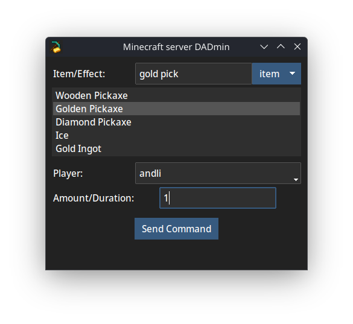
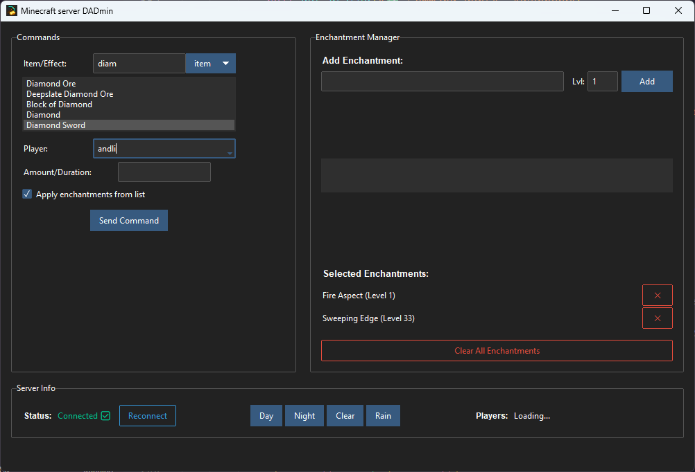

# dadmin — A Minecraft RCON Admin GUI

A minimalist dark-themed desktop GUI for administering a local Minecraft server via RCON. Helping you, the (d)admin, play survival mode with your kids without having to type `/give` all the bloody time. 😅

Right now the app supports giving _items_ (with _enchantments_) and applying _effects_.

The app is designed for localhost use and single-server setups.

**NB** the _dad_ can of course also be a mom. 👩‍💻 The pun is less effective that way though.



## Features

- 🔍 Fuzzy search for items, effects and item enchantments
- 🎮 Player selector with auto-refresh
- 🧪 Give items or apply effects via dropdown
- 🌍 Simple global command buttons

## Requirements

- A Minecraft server with RCON enabled (found in `server.properties`)
- `server_config.txt` with:

### Config

```
host=localhost
port=25575
password=1111 (replace with your own)
```

## Notes

- Item and effect data is loaded from JSON files in the `data/` directory, taken from https://github.com/PrismarineJS/minecraft-data/blob/master/data/pc/
- If you are missing items due to a Minecraft update, just replace the corresponding `/data` files or open an issue in this repo.


